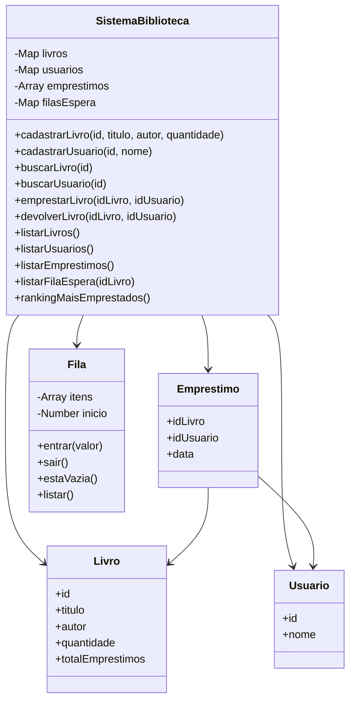

```mermaid
classDiagram
    class SistemaBiblioteca {
        -Map livros
        -Map usuarios
        -Array emprestimos
        -Map filasEspera
        +cadastrarLivro(id, titulo, autor, quantidade)
        +cadastrarUsuario(id, nome)
        +buscarLivro(id)
        +buscarUsuario(id)
        +emprestarLivro(idLivro, idUsuario)
        +devolverLivro(idLivro, idUsuario)
        +listarLivros()
        +listarUsuarios()
        +listarEmprestimos()
        +listarFilaEspera(idLivro)
        +rankingMaisEmprestados()
    }

    class Livro {
        +id
        +titulo
        +autor
        +quantidade
        +totalEmprestimos
    }

    class Usuario {
        +id
        +nome
    }

    class Emprestimo {
        +idLivro
        +idUsuario
        +data
    }

    class Fila {
        -Array itens
        -Number inicio
        +entrar(valor)
        +sair()
        +estaVazia()
        +listar()
    }

    SistemaBiblioteca --> Livro
    SistemaBiblioteca --> Usuario
    SistemaBiblioteca --> Emprestimo
    SistemaBiblioteca --> Fila
    Emprestimo --> Livro
    Emprestimo --> Usuario
```
